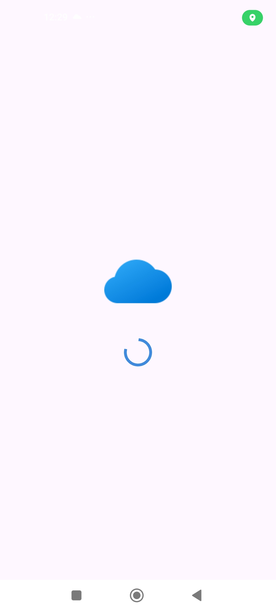
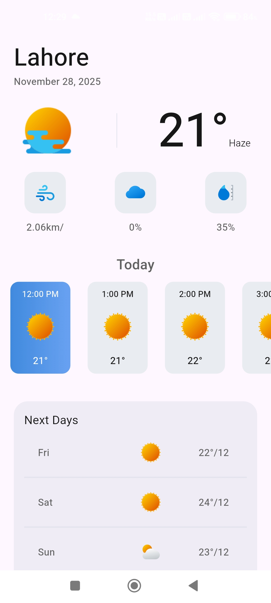
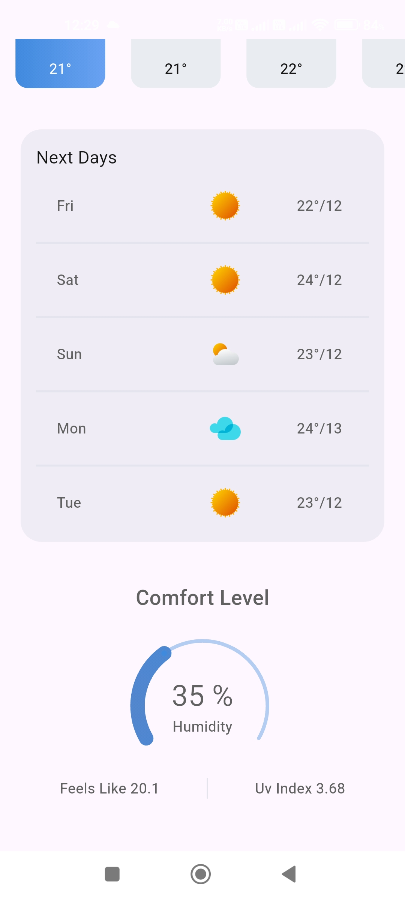

Weather App – Flutter | MVVM Architecture

A modern Weather Application built using Flutter and structured with the MVVM architecture. This app fetches real-time weather data through API integration and displays current, hourly, and daily forecasts with a clean and responsive UI using Provider State Management Solution.
The project focuses on clean code structure, proper state management, API handling, and scalable architecture, making it suitable for real-world production use and learning purposes.

---

Key Highlights:

• Clean MVVM architecture

• API integration for real-time weather data

• Provider State Management

• Responsive UI

• Error handling & loading states

• Optimized for performance

---

📸 Screenshots

 

    
    
    
 

 
---

Idea of this project is from youtuber **BackSlash Flutter** who create this project with **Getx and MVC Architecture** but i wanted to make this project as well as test my learnings so I created this weather app almost on my own and used **MVVM Architecture and Provider StateManagement Solution**. 
